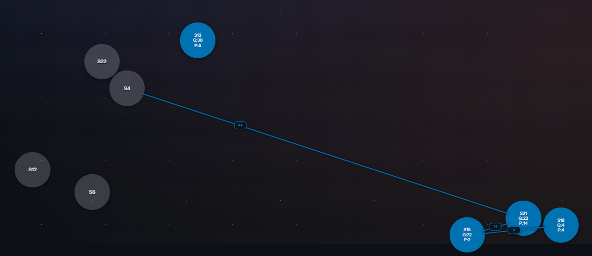
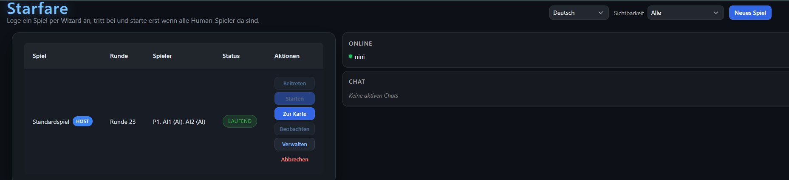
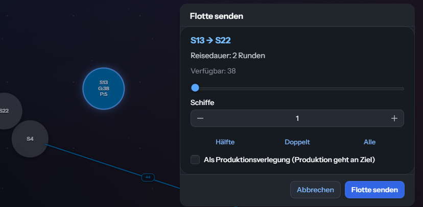
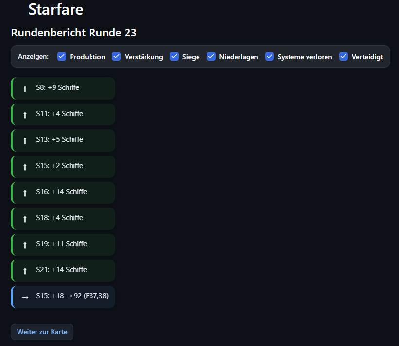

# Starfare

A turn-based 4X browser game: conquer star systems, dispatch fleets, win
by dominating the galaxy (in memory of a game I believe called "Sector Forces" on the C-64)

Built as a Spring Boot / Vaadin web application. Multiple players —
humans and AI — share a game; the turn is only resolved once every
human has submitted.

This repository is a personal showcase of a modern Java backend stack
(Java 25, Spring Boot 4, Vaadin 25, Spring Modulith, Flyway,
Testcontainers) wrapped around a small but complete game.

## Tech stack

- **Java 25** with virtual threads.
- **Spring Boot 4** — web, validation, security, data-jpa, flyway,
  actuator.
- **Vaadin 25 (Flow)** — server-driven UI, language switcher, fog of
  war on an SVG map.
- **Spring Modulith** — module boundaries verified on every test run.
- **PostgreSQL 17** via Flyway migrations and Testcontainers in tests.
- **Gradle (Groovy DSL)** with quality gates: ErrorProne + NullAway,
  SpotBugs, JaCoCo, SonarQube, OpenRewrite.

Architecture details: [docs/ARCHITECTURE.md](docs/ARCHITECTURE.md).

## Screenshots



*Galaxy map: own systems in blue, neutrals grey, a fleet in transit with
an ETA badge mid-route; fog of war keeps unseen systems frozen at their
last known state.*



*Lobby: running games with host actions, presence panel, chat, language
switcher and a per-user visibility menu.*



*Send-fleet dialog: ship slider with quick buttons (half / double / all),
travel-time preview, optional "as production transfer" mode.*



*Round report: a filterable timeline of production, reinforcements,
victories, defeats, and systems lost or defended.*

## Run it

Prerequisites: Java 25, Docker Desktop (for PostgreSQL).

```bash
./gradlew bootRun
```

On first start, `spring-boot-docker-compose` brings the Postgres
instance up automatically. Then open
[http://localhost:8080](http://localhost:8080).

For local development with Vaadin hot reload:

```bash
./gradlew bootRun -Pvaadin.productionMode=false
```

## Sign in

On first visit: create a user (username + password). Subsequent
sessions: log in with the same credentials. The username doubles as
the player name in games.

## Language

Top-right in the lobby and the map view there is a language switcher
(German / English). The choice is kept in the Vaadin session and
survives navigation and reload; the default is German.

## Lobby

The landing route `/` is the lobby. From there:

- **New game** — opens the wizard:
    - Galaxy size (number of systems)
    - Human players plus AI players
    - Colour for human 1
    - Neutral systems: min/max production
    - Starting production per player plus ships in the home system
    - Allow observers? Allow rejoining?
- **Join** — take an open slot. One slot per game; first come, first
  served.
- **Observe** — read-only spectator mode (when allowed by the game).
- **Start** — available once all human seats are filled. The initiator
  starts the game.
- **Open map** — for running games you are playing or observing.
- **Abort** — close the game entirely (only meaningful while nobody is
  actively playing).

## Map view (`/map/:gameId`)

Top: **Starfare**, game name, round number and an empire summary with
icons for owned systems, total production per round and total ships
(garrisons plus those en route).

Centre: the galaxy map. Owned systems are in the player's colour,
enemies in the opponent's colour, neutrals grey. Visibility is
fog-of-war based — enemy systems only show their last known state.
Travelling fleets are rendered as SVG lines with arrowheads; halfway
along sits a small pill with the ship count, whose tooltip shows the
arrival round and remaining turns.

- **Pan**: hold left mouse button and drag.
- **Select system**: click. First click as source, second click on a
  different system as target.
- The initial view centres on your home system.

### Send a fleet

1. Click your source system.
2. Click the target system.
3. Set the ship count via slider or input field. Quick buttons:
   **Half**, **Double**, **All** (max garrison).
4. **Send fleet**.

The order lands in **Planned orders** (left). Until the turn ends you
can take it back via **Cancel**.

### Own fleets (table)

Already in transit. Columns: No, From, To, Ships, ETA.

- **Wait** — the fleet rests one round at its current position
  (ETA +1).
- **Disband** — the ships are abandoned. Only allowed in certain
  states.

### End the round

Bottom left:

- **Next round** — submits your turn. Once all humans have submitted,
  the turn pipeline runs (production → wait orders →
  arrivals/combat → AI turns → victory check → next round).
- **Leave game** — your seat becomes AI. If rejoining is allowed, you
  can come back later.
- **Back to lobby** — exit the map view; the game keeps running.

After every turn change the app shows a **round report** with the
events (production, combat, conquests). Continue via **Back to map**.

## Victory condition

Whoever controls more than 50% of the star systems wins. The game ends
and a _"Game over. Winner: …"_ message is shown.

## Observer mode

If "allow observers" was checked at game creation, non-participating
users can follow the map live. In pure-AI games the round runs
automatically (autoplay) until the last observer leaves or the game
ends.

## Tests

```bash
./gradlew test
```

Integration tests start a single PostgreSQL container via
Testcontainers; Docker must be running.

## License

[MIT](LICENSE).
