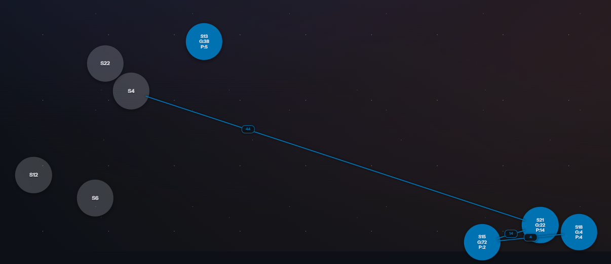
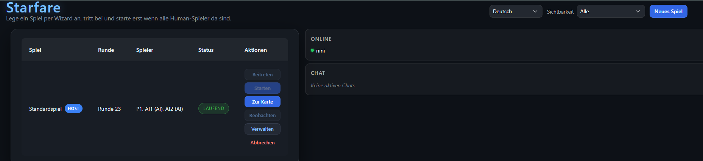
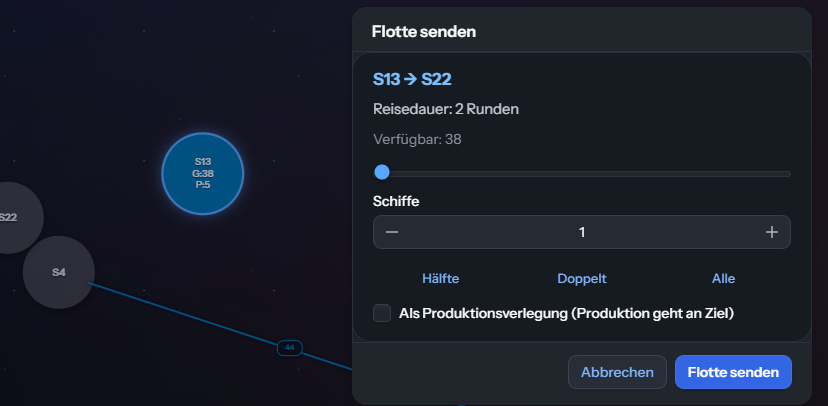
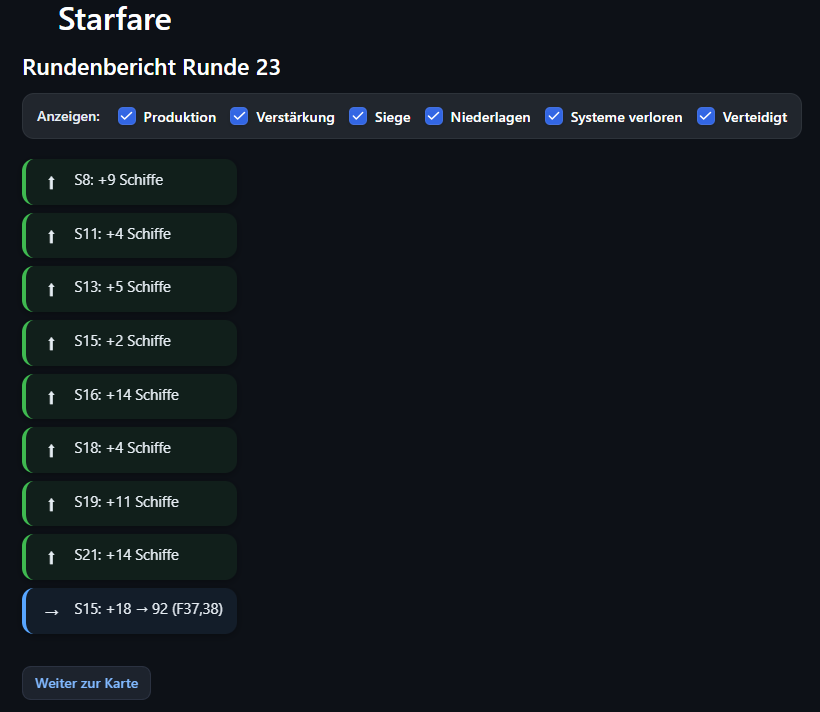

# Starfare

A turn-based 4X browser game: conquer star systems, dispatch fleets, win
by dominating the galaxy (in memory of a game I believe called "Sector Forces" on the C-64)

Built as a Spring Boot / Vaadin web application. Multiple players —
humans and AI — share a game; the turn is only resolved once every
human has submitted.

This repository is a personal showcase of a modern Java backend stack
(Java 25, Spring Boot 4, Vaadin 25, Spring Modulith, Flyway,
Testcontainers) wrapped around a small but complete game.

## Lobby and archive

New games are private. Use **Manage** to invite players or publish the game
before it starts. Public games can be found by other signed-in players; private
games are visible to the host, seat holders and invitees. Visibility is fixed
once the game starts.

Finished games move from the lobby to **Archive**. Search by game or player name,
filter your games and open a completed map without issuing further orders.
In the completed map, select any participant (including AI) and enable **Fog of war**
to see their final perspective. Disable fog to reveal all systems and fleets.
The controls inspect the final state; they do not rewind earlier turns.
Private archives remain restricted to the host and seat holders. For public
archives, outsiders can open the map only when spectators are allowed. Games
are retained; no automatic deletion is enabled.

## Tech stack

- **Java 25** with virtual threads.
- **Spring Boot 4** — web, validation, security, data-jpa, flyway,
  actuator.
- **Vaadin 25 (Flow)** — server-driven UI, language switcher, fog of
  war on an SVG map.
- **Spring Modulith** — module boundaries verified on every test run.
- **PostgreSQL 17** via Flyway migrations and Testcontainers in tests.
- **Gradle (Groovy DSL)** with quality gates: ErrorProne + NullAway,
  SpotBugs, JaCoCo, SonarQube, OpenRewrite.

Architecture details: [docs/ARCHITECTURE.md](docs/ARCHITECTURE.md).

## Screenshots



*Galaxy map: own systems in blue, neutrals grey, a fleet in transit with
an ETA badge mid-route; systems within sensor range show a rough garrison
estimate, everything beyond stays frozen at its last known state.*



*Lobby: running games with host actions, search and status filter,
presence panel, chat, language switcher and a per-user visibility menu.*



*Send-fleet dialog: ship slider with quick buttons (half / double / all),
travel-time preview, optional "as production transfer" mode.*



*Round report: a filterable timeline of production, reinforcements,
victories, defeats, and systems lost or defended.*

## Run it

Prerequisites: Java 25, Docker Desktop (for PostgreSQL).

```bash
./gradlew bootRun
```

On first start, `spring-boot-docker-compose` brings the Postgres
instance up automatically and supplies its connection details. The local database
port is bound to loopback. Without Docker Compose, set `SPRING_DATASOURCE_URL`,
`SPRING_DATASOURCE_USERNAME` and `SPRING_DATASOURCE_PASSWORD` explicitly; the
application has no fallback credentials. Then open
[http://localhost:8080](http://localhost:8080).

For local development with Vaadin hot reload:

```bash
./gradlew bootRun -Pvaadin.productionMode=false
```

The Sonar analysis includes application sources, authored frontend files and
both test source sets. Generated frontend files are excluded. Run all checks
with `./gradlew build e2eTest sonar` against the configured SonarQube server.

## Sign in

On first visit: create an account with email address, public player name and
password, then confirm the email address. Subsequent sessions use the email
address and password. Starfare stores the internal account ID as the player
reference; the public player name is shown in games.

For real verification and password-reset mail, start with the `brevo` profile.
It reads the SMTP login, key and verified sender address from the external file
`~/.config/starfare/brevo.yaml` under `starfare.mail.username`,
`starfare.mail.password` and `starfare.mail.from-address`.

## Language

Top-right in the lobby and the map view there is a language switcher
(German / English). The choice is kept in the Vaadin session and
survives navigation and reload; the default is German.

## Lobby

The landing route `/` is the lobby. From there:

- **New game** — opens the wizard:
    - Galaxy size (number of systems)
    - Human players plus AI players
    - A colour per seat (duplicates fall back to a free palette entry)
    - Neutral systems: min/max production
    - Starting production per player plus ships in the home system
    - Allow observers? Allow rejoining?
- **Search / filter** — narrow the list by game or player name, and by
  status: all, mine, open, running or finished games.
- **Join** — take an open slot. One slot per game; first come, first
  served.
- **Observe** — read-only spectator mode (when allowed by the game).
- **Start** — available once all human seats are filled. The initiator
  starts the game.
- **Open map** — for running games you are playing or observing.
- **Abort** — close the game entirely (only meaningful while nobody is
  actively playing).

## Map view (`/map/:gameId`)

Top: **Starfare**, game name, round number and an empire summary with
icons for owned systems, total production per round and total ships
(garrisons plus those en route).

Centre: the galaxy map. Owned systems are in the player's colour,
enemies in the opponent's colour, neutrals grey. Visibility comes in
three levels:

- **Own systems** — exact garrison and production.
- **Within sensor range** — up to two travel rounds from one of your
  systems or a fleet's destination. Owner and colour are live, the
  garrison is only a rough estimate (shown as `~G:`).
- **Everything else** — whatever you last learned in combat there
  (`G:`, with the round it was seen in the tooltip), or nothing at all.

Travelling fleets are rendered as SVG lines with arrowheads; halfway
along sits a small pill with the ship count, whose tooltip shows the
arrival round and remaining turns.

- **Pan**: hold left mouse button and drag.
- **Select system**: click. First click as source, second click on a
  different system as target.
- The initial view centres on your home system.

### Send a fleet

1. Click your source system.
2. Click the target system.
3. Set the ship count via slider or input field. Quick buttons:
   **Half**, **Double**, **All** (max garrison).
4. **Send fleet**.

The order lands in **Planned orders** (left). Until the turn ends you
can take it back via **Cancel**.

Ticking **as production transfer** turns the order into a standing one: the
given number of ships is shipped every turn. A system may route at most its
own production plus whatever is routed into it, and several targets share that
budget — the map shows the still-free share in brackets after `P:`. Whatever
is not routed stays behind as garrison.

### Own fleets (table)

Already in transit. Columns: No, From, To, Ships, ETA.

- **Wait** — the fleet rests one round at its current position
  (ETA +1).
- **Disband** — the ships are abandoned. Only allowed in certain
  states.

### End the round

Bottom left:

- **Next round** — submits your turn. Once all humans have submitted,
  the turn pipeline runs (production → wait orders →
  arrivals/combat → AI turns → victory check → next round).
  A seat that does not submit within five minutes is handed to the AI
  permanently, so a single idle player cannot stall the game.
- **Leave game** — your seat becomes AI. If rejoining is allowed, you
  can come back later.
- **Back to lobby** — exit the map view; the game keeps running.

After every turn change the app shows a **round report** with the
events (production, combat, conquests). Battle entries can be clicked to
reveal them with a short animation and sound. Continue via **Back to
map**.

## Victory condition

Whoever controls at least 70% of the star systems wins — neutral systems
count towards the total, so a galaxy that is still largely unclaimed
cannot be won. The game ends and a _"Game over. Winner: …"_ message is
shown. The threshold is `GameConfig.VICTORY_SYSTEM_PERCENT`.

## Observer mode

If "allow observers" was checked at game creation, non-participating
users can follow the map live. In pure-AI games the round runs
automatically (autoplay) until the last observer leaves or the game
ends.

## Release

`appVersion` in `gradle.properties` drives releases. While it ends in
`-SNAPSHOT`, pushes to `main` only build and test. To release:

1. Remove the `-SNAPSHOT` suffix.
2. Rename `## Unreleased` in `CHANGELOG.md` to `## <appVersion> - <date>`.
3. Commit and push to `main`. The workflow tags `v<appVersion>`, creates a
   GitHub Release with the changelog section and `starfare.jar`, then bumps
   `appVersion` to the next patch `-SNAPSHOT` (`[skip ci]`) — run `git pull`
   before continuing. There is no deployment step.

## Tests

`./gradlew test` runs the unit and integration tests (PostgreSQL via
Testcontainers). `./gradlew e2eTest` runs the Cucumber/Selenium smoke test
against the real application in headless Chrome — register, confirm the
e-mail, log in, create and start a game, play one round. It is not part of
`build`; CI runs it as a separate job (`[skip e2e]` in the commit message
skips it). Failures leave page text and a screenshot in `build/e2e-failures/`.

```bash
./gradlew test
```

Integration tests start a single PostgreSQL container via
Testcontainers; Docker must be running.

## License

[MIT](LICENSE).
