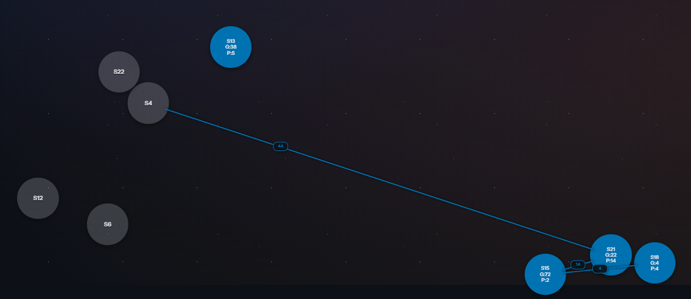
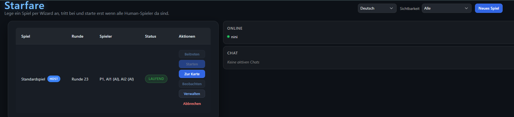
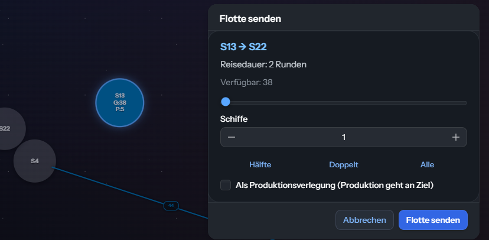
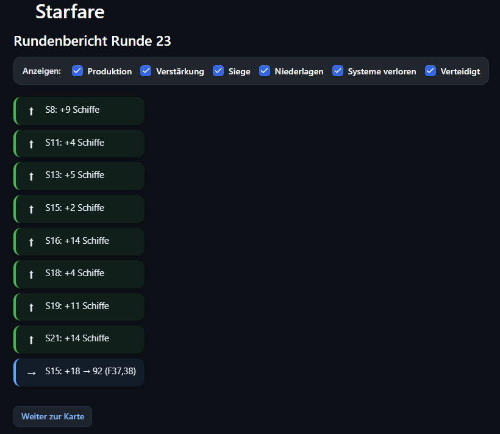

# Starfare

[](https://github.com/MichaelZett/starfare/actions/workflows/build.yml?query=branch%3Amain)
[](https://sonarcloud.io/project/overview?id=MichaelZett_starfare)
[](https://sonarcloud.io/component_measures?id=MichaelZett_starfare&metric=coverage)

A turn-based 4X browser game: conquer star systems, dispatch fleets, win
by dominating the galaxy (in memory of a game I believe called "Sector Forces" on the C-64)

Built as a Spring Boot / Vaadin web application. Multiple players —
humans and AI — share a game; the turn is only resolved once every
human has submitted.

This repository is a personal showcase of a modern Java backend stack
(Java 25, Spring Boot 4, Vaadin 25, Spring Modulith, Flyway,
Testcontainers) wrapped around a small but complete game.

**Spielanleitung auf Deutsch:** [Anleitung](docs/ANLEITUNG.md).

## System inspector

The system inspector on the right includes a schematic stellar system with
selectable stars, planets and moons. Its shipyard represents existing production;
the illustration changes no game rules or saved state. It is available only when
the system is fully revealed and its battle results are no longer pending.
See [System illustrations](docs/SYSTEM-ILLUSTRATIONS.md) for sources and simplifications.

## Lobby and archive

New games are private. Use **Manage** to invite players or publish the game
before it starts. Public games can be found by other signed-in players; private
games are visible to the host, seat holders and invitees. Visibility is fixed
once the game starts.

Finished games move from the lobby to **Archive**. Search by game or player name,
filter your games and open a completed map without issuing further orders.
When the final round contains a battle, the normal round report remains open first.
Resolve every battle from that report, individually or together in **Instant** mode;
only then does the victory or defeat dialog appear,
with personal totals for built, destroyed and lost ships.
In the completed map, select any participant (including AI) and enable **Fog of war**
to see their final perspective. Disable fog to reveal all systems and fleets.
For newly completed games, the timeline can rewind to every resolved round;
**Final state** returns to the perspective and fog controls.
Private archives remain restricted to the host and seat holders. For public
archives, outsiders can open the map only when spectators are allowed. Games
are copied to an independent archive. Optional cleanup of the operative session
is disabled by default and retains archive replay and statistics.

## Map sidebar

Map controls provide zoom, reset, whole-galaxy and own-empire views plus a legend.
Focusable map objects and action cards accept Enter and Space. Background updates
preserve unchanged input controls and focus. **My account** groups statistics,
archive and account actions; imprint and privacy share a footer.

The Fleets tab aggregates your fleets and queued sends by destination and arrival
turn, including waits. Use **Edit order** to change a queued send's destination or
amount. **Undo last order change** reverses your most recent queue change in the
same round, including after a reload or server restart. It cannot override a newer
garrison reserve or undo a resolved turn.

**Send fleets together** previews arrivals from multiple selected sources before
queuing the batch. **Set reserves together** retains a fixed amount or one round
of production, capped at the current garrison. Both actions validate the entire
selection and reject stale turns or unavailable ships without partial changes.

With battle speed **Instant**, **Resolve all open battles** acknowledges the complete
round. Speed, sound, report/logistics filters, route search and sidebar width are
saved per account and restored on later sign-ins.

Use **Use as template / rematch** on your lobby or archive games to reuse the
original settings with a new map. Rematches reserve the previous human seats;
players still join themselves. Games created before original settings were saved
cannot be used as templates. New games remain private until explicitly published.

The right-hand sidebar keeps the map visible and switches between Contacts,
Details, Fleets, Orders, Relocations, Logistics and Report. Contacts retain the last
known hostile systems with an estimate or a counted garrison. Select a system or fleet on
the map to inspect it in Details: systems show their known ownership history,
fleets their owner, launch turn, travel time and ETA. The report entry contains
the complete filterable round timeline, including victory and defeat reports.
Submitting a new command opens Orders; resolving a new round opens Report.
Systems mentioned in a report carry a gold marker on the map. Select a report
entry to centre the map on it, or select the marker to return to its report
entry.
Production relocations appear as purple dashed connections with their amount.
Drag one of your systems onto another system to create or replace a relocation;
the dialog limits the amount to the available routing capacity.
All game commands remain available only in a running game.

## Tech stack

- **Java 25** with virtual threads.
- **Spring Boot 4** — web, validation, security, data-jpa, flyway,
  actuator.
- **Vaadin 25 (Flow)** — server-driven UI, language switcher, fog of
  war on an SVG map.
- **Spring Modulith** — module boundaries verified on every test run.
- **PostgreSQL 17** via Flyway migrations and Testcontainers in tests.
- **Gradle (Groovy DSL)** with quality gates: ErrorProne + NullAway,
  SpotBugs, JaCoCo, SonarQube, OpenRewrite.

Architecture details: [docs/ARCHITECTURE.md](docs/ARCHITECTURE.md).

## Screenshots

These images show earlier interface versions. Current controls and behavior are
described in the sections below and in the [German guide](docs/ANLEITUNG.md).



*Galaxy map: own systems in blue, neutrals grey, a fleet in transit with
an ETA badge mid-route; systems within sensor range show a rough garrison
estimate, everything beyond stays frozen at its last known state.*



*Lobby: running games with host actions, search and status filter,
presence panel, chat, language switcher and a per-user visibility menu.*



*Send-fleet dialog: ship slider with quick buttons (half / double / all /
all except production), travel-time preview, optional "as production transfer"
mode. A configurable garrison reserve stays at the source system.*

Completed games are retained as compact results for the personal statistics
page (`/statistics`), including wins, losses, draws and the record against each
opponent. The page shows the result balance and opponent records as cards while
retaining the recent game history. Statistics resolve opponent names in one
batch for both the opponent cards and game history.
For newly completed games, the archive map also provides a timeline for replaying
each resolved round.

Direct-message conversations track read state and can be archived independently
by either participant. Messages older than one year can be removed through the
message service without affecting invitations or game archives.



*Round report: a filterable timeline of production, reinforcements,
victories, defeats, and systems lost or defended.*

## Run it

Prerequisites: Java 25, Docker Desktop (for PostgreSQL).

```bash
./gradlew bootRun
```

On first start, `spring-boot-docker-compose` brings the Postgres
instance up automatically and supplies its connection details. The local database
port is bound to loopback. Without Docker Compose, set `SPRING_DATASOURCE_URL`,
`SPRING_DATASOURCE_USERNAME` and `SPRING_DATASOURCE_PASSWORD` explicitly; the
application has no fallback credentials. Then open
[http://localhost:8110](http://localhost:8110).

For local development with Vaadin hot reload:

```bash
./gradlew bootRun -Pvaadin.productionMode=false --args=--vaadin.productionMode=false
```

The SonarCloud analysis includes application sources, authored frontend files and
both test source sets. Generated frontend files are excluded. Set `SONAR_TOKEN`
locally and run `./gradlew sonar`; CI uses the repository secret of the same name.

## Sign in

On first visit: create an account with email address, public player name and
password, then confirm the email address. Subsequent sessions use the email
address and password. Starfare stores the internal account ID as the player
reference; the public player name is shown in games.

For real verification and password-reset mail, start with the `brevo` profile.
It reads the SMTP login, key and verified sender address from the external file
`~/.config/starfare/brevo.yaml` under `starfare.mail.username`,
`starfare.mail.password` and `starfare.mail.from-address`.

## Language

Top-right in the lobby and the map view there is a language switcher
(German / English). The choice is kept in the Vaadin session and
survives navigation and reload; the default is German.

## Lobby

The landing route `/` is the lobby. From there:

- **New game** — opens the wizard:
    - Galaxy size: 8–120 systems, never fewer than the participating players
    - Up to 8 human players and 7 AI players; at most 10 participants together
    - A colour per seat (duplicates fall back to a free palette entry)
    - Neutral and starting production: 1–20 per turn; home-system ships: 1–50
    - Allow observers? Allow rejoining?
    - Victory threshold: 10–100% of all systems, default 70%
    - Combat strength variation: 0–30%, default ±10%, fixed for the game
    - Round and straggler deadlines, and attack order for multiple attackers
    - Battle presentation on by default; each account's saved speed choice overrides it
- **Search / filter** — narrow the list by game or player name, and by
  status: all, mine, open or running games. Finished games are in **Archive**.
- **Join** — take an open slot. One slot per game; first come, first
  served.
- **Observe** — read-only spectator mode (when allowed by the game).
- **Start** — available once all human seats are filled. The initiator
  starts the game.
- **Open map** — for running games you are playing or observing.
- **Abort** — close the game entirely (only meaningful while nobody is
  actively playing).

## Privacy

The public `/privacy` page explains the processed data and retention; `/imprint`
contains the responsible provider and its contact details. Signed-in players can
permanently delete their account at `/account/delete`. Direct and party-chat
messages are removed after 365 days.

## Map view (`/map/:gameId`)

Top: **Starfare**, game name, round number and an empire summary with
icons for owned systems, total production per round and total ships
(garrisons plus those en route).

Centre: the galaxy map. Owned systems are in the player's colour,
enemies in the opponent's colour, neutrals grey. Visibility comes in
three levels:

- **Own systems** — exact garrison and production.
- **Within sensor range** — up to two travel rounds from one of your
  systems or a fleet's destination. Owner and colour are live, the
  garrison is only a rough estimate (shown as `~G:`).
- **Everything else** — whatever you last learned in combat there
  (`G:`, with the round it was seen in the tooltip), or nothing at all.

System diameters provide an extra map cue without leaking hidden information:
your systems follow their production, sensor estimates follow estimated
production, and systems without current intelligence all have the same size.

Travelling fleets are rendered as SVG lines with arrowheads; halfway
along sits a small pill with the ship count, whose tooltip shows the
arrival round and remaining turns.

- **Pan**: hold left mouse button and drag.
- **Select system**: click. First click as source, second click on a
  different system as target.
- The initial view centres on your home system.

### Send a fleet

1. Click your source system.
2. Click the target system.
3. Set the ship count via slider or input field. Quick buttons:
   **Half**, **Double**, **All** (available ships after reserves and queued sends),
   and **All except production**.
4. **Send fleet**.

The order lands in **Orders** in the right-hand sidebar. Before submitting your
turn, use **Edit order** to change its amount or target, or **Cancel** to remove it.
**Undo last order change** restores your queue before the most recent command
change, including a whole batch. It is a single undo step, not an undo history.

Ticking **as production transfer** turns the order into a standing one: the
given number of ships is shipped every turn. A system may route at most its
own production plus whatever is routed into it, and several targets share that
budget — the map shows the still-free share in brackets after `P:`. Whatever
is not routed stays behind as garrison. The **Relocations** tab also offers
**Edit** and **Delete** on every route; editing opens the same capacity-aware
dialog.

### Own fleets

The **Fleets** tab shows route cards for ships already in transit and a combined
arrival preview with queued sends. Select a card to see fleet details. Route
search filters the cards; the summary groups arrivals by destination and round.

- **Wait** — the fleet rests one round at its current position
  (ETA +1).
- **Disband** — the ships are abandoned. Only allowed in certain
  states.

### End the round

In the header:

- **Submit turn** — submits your turn. The button then reads **Submitted**
  and is disabled; the round bar names the players still to submit. This notice
  survives reload and disappears when the next round starts. Once all humans have submitted,
  the turn pipeline runs (AI orders → all orders → production → wait
  orders → arrivals/combat → victory check → next round).
  A bar below the header shows every human with a check mark once they
  have submitted. With two or more humans each round has a deadline: the
  round limit (default 5 min) from the start of the round, and the
  straggler limit (default 1 min) as soon as only one player is missing —
  their chip then shows the countdown. Both are set per game in the
  wizard, from 30 seconds up to several days. Whoever misses the deadline
  moves with the orders given so far; after three missed rounds in a row
  the AI takes over the seat.
  The host can adjust deadlines during play through **Round deadlines** in the
  map menu. A game with only one human has no automatic round deadline.
- **Leave game** — your seat becomes AI. If rejoining is allowed, you
  can come back later.
- **Back to lobby** — exit the map view; the game keeps running.

After every turn change the app shows a **round report** with the
events (production, combat, conquests). A battle card first only names its
location. Click it for a separate battle playback: both fleet strengths count
down over a sun-and-planet background, with scaled ship markers and optional
sound. The browser activates audio on the first click on a battle card. Use
the report's **Speed** selector to choose **0.5×, 1×, 1.5×, 2×, Instant**.
**Instant** skips animation and also offers **Resolve all open battles**, including
battles hidden by report filters. Speed and sound are saved per account for later
rounds and sign-ins; the wizard default applies until you make a personal choice.
The playback dialog also lets you change animation speed and test or switch sound.
The result appears only after acknowledging the battle;
until then the map shows a large battle marker and conceals the affected
system's owner and values. Continue via **Back to map**.
Battle acknowledgements are saved per account, game, round and event; reloading
or signing in on another device does not reset them. Display speed does not
change combat outcomes or round deadlines.
Both fleets begin in neutral yellow and turn green or red only with the final
result. A pending map marker keeps neutral systems grey and known player-system
colours faded, without revealing combat details.

## Victory condition

The wizard sets the required share of all systems (10–100%, default 70%).
Neutral systems count towards the total. Once a player reaches the configured
share, the game ends; after pending battles are acknowledged, the result dialog
shows the winner and personal ship totals.

The winner can choose **Continue until every system is conquered** to resume toward 100%.
This restarts the round deadlines and clears submissions without advancing the
round. Other participants are informed automatically. The first result remains
in personal statistics; continued play does not replace it with a second result.

## Observer mode

If "allow observers" was checked at game creation, non-participating
users can follow the map live. They select a participant perspective and can
switch the fog of war on or off; spectator views never permit commands. In
pure-AI games the round runs automatically (autoplay) until the last observer leaves or the game
ends.

## Release

`appVersion` in `gradle.properties` drives releases. It currently is
`1.0.0-SNAPSHOT`; while a version ends in `-SNAPSHOT`, pushes to `main` only
build and test. To release:

1. Remove the `-SNAPSHOT` suffix.
2. Rename `## Unreleased` in `CHANGELOG.md` to `## <appVersion> - <date>`.
3. Commit and push to `main`. The workflow tags `v<appVersion>`, creates a
   GitHub Release with the changelog section and `starfare.jar`, then bumps
   `appVersion` to the next patch `-SNAPSHOT` (`[skip ci]`) — run `git pull`
   before continuing. There is no deployment step.

### zs-hetzner preparation

The `hetzner` Spring profile disables local Docker Compose and enables forwarded
headers for the reverse proxy. Before public operation, provide these Coolify
environment variables: `STARFARE_BASE_URL`, `STARFARE_LEGAL_OPERATOR_NAME`,
`STARFARE_LEGAL_POSTAL_ADDRESS`, and `STARFARE_LEGAL_CONTACT_EMAIL`. The
deployment also needs PostgreSQL connection settings and the Brevo mail profile.
Deploy only after the unused services have been removed and the host capacity has
been checked.

## Tests

`./gradlew test` runs the unit and integration tests (PostgreSQL via
Testcontainers). `./gradlew e2eTest` runs Cucumber/Selenium journeys
against the real application in headless Chrome: registration and one round,
lobby access, round submission, battle playback, logistics and amount selection,
fleet details and separate map viewports. Two browser sessions verify live chat,
draft preservation and continuation through a second game end. It is not part of
`build`; additional journeys cover bulk reserves and fleet dispatch, editing and
undo, saved filters after a new sign-in, rematches, keyboard interaction and
preserved inputs during external updates. CI runs it as a separate job
(`[skip e2e]` in the commit message skips it). Failures leave page text in the
test output and a screenshot in `build/e2e-failures/`.

```bash
./gradlew test
./gradlew e2eTest
node --test src/test/frontend/battle-replay.test.mjs
```

Integration tests start a single PostgreSQL container via
Testcontainers; Docker must be running.

## License

[MIT](LICENSE).
